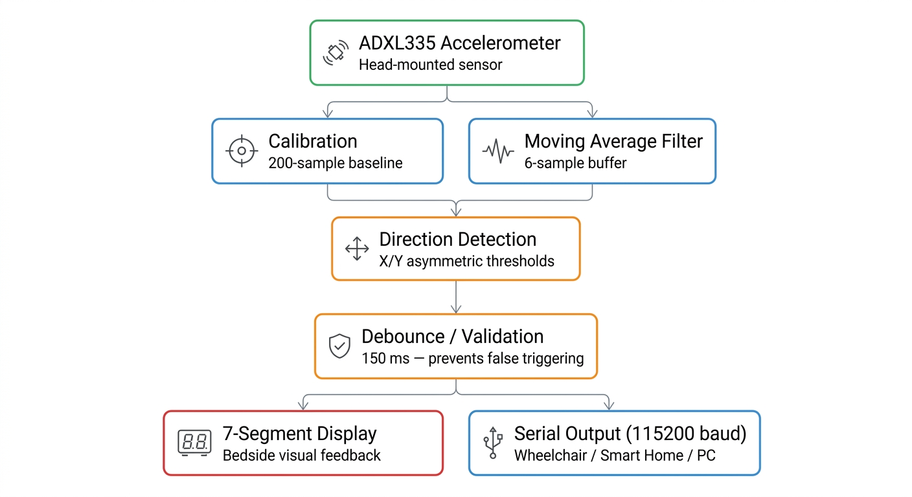
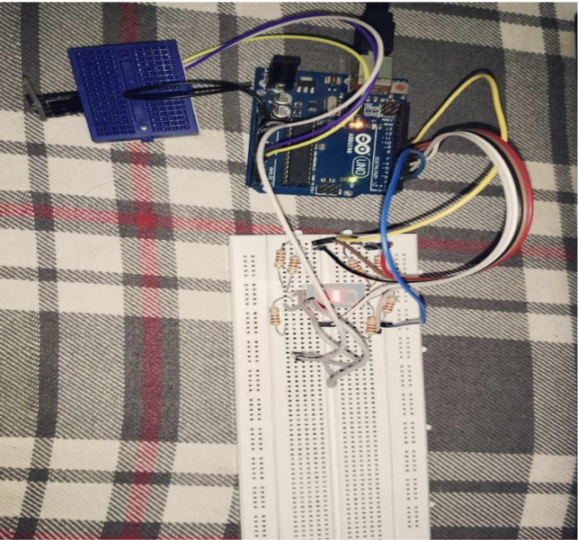
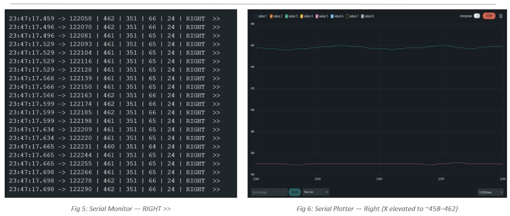
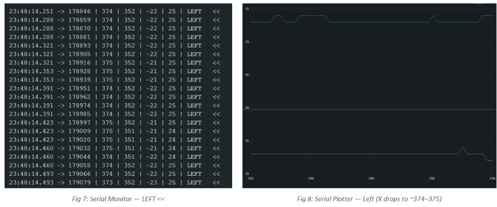
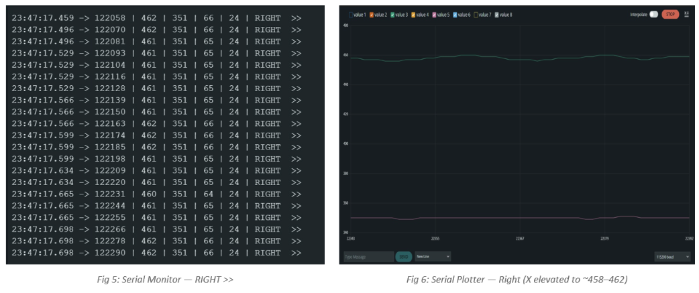
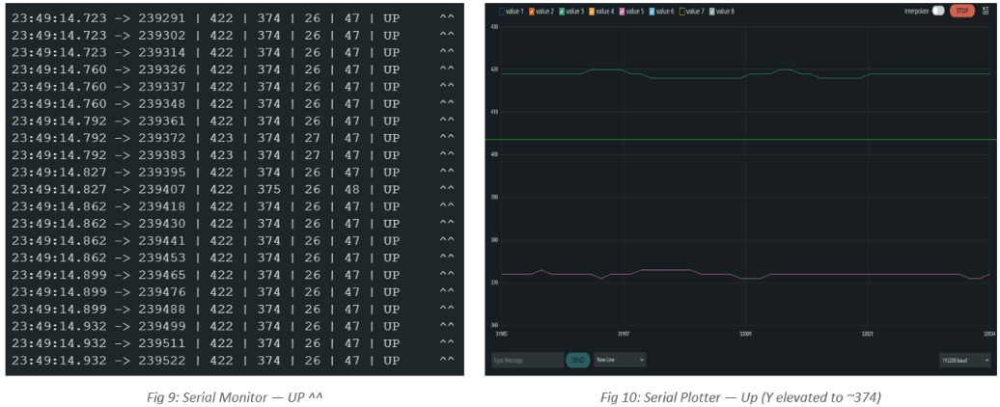
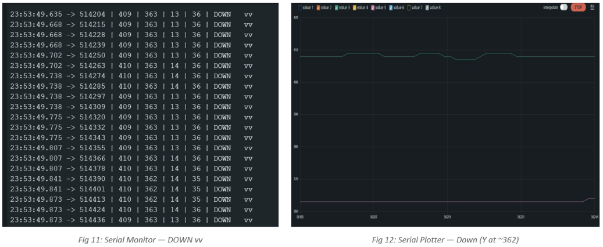

# Head Movement-Based Biomedical Assistive System

A low-cost, wearable biomedical assistive system for real-time head
movement detection using an **ADXL335 triaxial accelerometer** and
**Arduino Uno**. The system detects five head-movement
states---**Neutral, Left, Right, Up, and Down**---using calibrated X/Y
analog signals, moving-average filtering, asymmetric threshold logic,
and debounce control. Detected directions are displayed on a
common-anode 7-segment display and transmitted through the Serial
interface.

## Overview

The system is designed as a hands-free assistive interface for
quadriplegic patients. An ADXL335 accelerometer mounted on the patient's
head provides X- and Y-axis analog signals. A patient-specific startup
calibration establishes the neutral baseline, while a size-6
moving-average filter suppresses signal noise. The filtered changes from
baseline are classified using asymmetric thresholds, and a 150 ms
debounce interval helps prevent false triggering.

The current prototype provides visual feedback through a 7-segment
display and structured serial output, providing a foundation for future
wheelchair, smart-home, or IoT integration.

## System Workflow

``` text
ADXL335 X/Y Analog Acquisition
            ↓
   200-Sample Calibration
            ↓
    Size-6 Moving Average
            ↓
 Asymmetric Threshold Detection
            ↓
      150 ms Debounce
            ↓
   Direction Classification
        ↙           ↘
7-Segment Display   Serial Output
```



## Objectives

-   Design a wearable, low-cost assistive system using ADXL335 and
    Arduino Uno.
-   Acquire real-time X/Y analog acceleration signals with
    patient-specific calibration.
-   Reduce signal noise using a moving-average filter implemented as a
    ring buffer.
-   Classify head movements into **Left, Right, Up, Down, and Neutral**
    states.
-   Display the classified direction on a 7-segment display.
-   Transmit timestamp, X, Y, dx, dy, and direction through Serial at
    115200 baud.
-   Validate the system using real-time Serial Monitor and Serial
    Plotter visualization.

## Hardware Components

  -----------------------------------------------------------------------
  Component                           Function
  ----------------------------------- -----------------------------------
  **ADXL335 Triaxial Accelerometer**  Detects head movement through
                                      analog X/Y acceleration signals

  **Arduino Uno R3**                  Reads sensor signals and executes
                                      filtering and detection logic

  **Common-Anode 7-Segment Display**  Provides visual direction feedback

  **Breadboard & Jumper Wires**       Prototype interconnections

  **USB Cable**                       Arduino power and serial
                                      communication
  -----------------------------------------------------------------------



### Sensor Connections

-   ADXL335 X-axis → **Arduino A0**
-   ADXL335 Y-axis → **Arduino A1**
-   Arduino executes the calibration, filtering, classification, and
    output logic.

## Software Implementation

### 1. Patient-Specific Calibration

At startup, the system acquires **200 ADC samples** while the head is
kept still. The average values become the neutral reference:

``` text
baselineX = average X samples
baselineY = average Y samples
```

This allows the system to adapt to the sensor's mounting position and
the individual user.

### 2. Moving-Average Filtering

A ring buffer containing **6 samples per axis** is used to calculate the
moving average:

``` text
Filtered signal = mean of the latest 6 samples
```

This suppresses high-frequency noise before movement classification.

### 3. Threshold-Based Direction Detection

The filtered displacement from the baseline is calculated as:

``` text
dx = filteredX - baselineX
dy = filteredY - baselineY
```

Asymmetric thresholds are then used:

  Parameter           Value
  ----------------- -------
  UP_THRESHOLD           40
  DOWN_THRESHOLD         10
  RIGHT_THRESHOLD        18
  LEFT_DX_MIN             4
  LEFT_DY_MIN             8

The logic classifies the movement into:

**UP, DOWN, LEFT, RIGHT, or NEUTRAL**

### 4. Debounce Logic

A **150 ms debounce interval** is applied after a direction change to
suppress transient noise and unintended micro-movements.

### 5. Output Generation

The detected direction is provided through two interfaces.

**7-Segment Display**

``` text
UP      → u
DOWN    → d
LEFT    → l
RIGHT   → r
NEUTRAL → -
```

**Serial Output**

``` text
timestamp | X | Y | dx | dy | direction
```

Serial communication is configured at **115200 baud**.

## Detected ADC Values

The prototype produced the following approximate ADC values during the
demonstrated movement conditions:

  Direction     X ADC (\~)   Y ADC (\~) 7-Segment   Serial Code
  ----------- ------------ ------------ ----------- --------------
  Neutral              391          328 ---         `NEUTRAL --`
  Right                461          351 r           `RIGHT >>`
  Left                 374          352 l           `LEFT <<`
  Up                   422          374 u           `UP ^^`
  Down                 409          363 d           `DOWN vv`

## Results

### Neutral Position

The X and Y traces remained stable around the neutral position,
demonstrating effective noise suppression.



### Right Head Tilt

The X-axis ADC increased above the positive threshold while the Y-axis
remained comparatively stable. The 7-segment display indicated `r`.



### Left Head Tilt

The X-axis ADC decreased below the negative threshold while the Y-axis
remained comparatively stable. The 7-segment display indicated `l`.



### Upward Head Movement

The Y-axis ADC increased above the upward threshold. The 7-segment
display indicated `u`.



### Downward Head Movement

The Y-axis ADC changed to the downward detection region. The 7-segment
display indicated `d`.



## Applications

The serial output format provides a foundation for integration with:

-   Hands-free assistive control interfaces
-   Wheelchair control systems
-   Smart-home control
-   IoT-based assistive devices
-   Other accessibility-oriented human-machine interfaces

## Future Scope

-   Wheelchair integration through motor-controller mapping.
-   Bluetooth / Wi-Fi communication for IoT applications.
-   Z-axis and rotational movement detection for an expanded command
    vocabulary.
-   Adaptive thresholding to compensate for posture drift.
-   Machine-learning-based movement classification.

## Project Structure

``` text
head-movement-assistive-system/
│
├── README.md
├── LICENSE
├── src/
│   └── head_movement_detection.ino
├── assets/
│   ├── system_architecture.png
│   ├── hardware_prototype.jpg
│   ├── neutral_position.png
│   ├── right_head_tilt.png
│   ├── left_head_tilt.png
│   ├── upward_head_movement.png
│   └── downward_head_movement.png
└── docs/
    └── project_report.pdf
```

## How to Run

1.  Connect the ADXL335 X-axis output to **A0** and Y-axis output to
    **A1** on the Arduino Uno.
2.  Connect the common-anode 7-segment display according to the pin
    definitions in the Arduino program.
3.  Open `src/head_movement_detection.ino` in the Arduino IDE.
4.  Select **Arduino Uno** and the correct COM port.
5.  Upload the program.
6.  Keep the sensor/head still during startup calibration.
7.  Open Serial Monitor at **115200 baud**.
8.  Perform the intended head movements and observe the 7-segment and
    Serial outputs.

## Limitations

This repository presents a prototype for head-movement detection and
assistive-interface development. It does not implement direct wheelchair
actuation or provide clinical validation. Such integrations require
additional safety mechanisms, system-level validation, and appropriate
testing.

## References

1.  Son T. Nguyen, Tu M. Pham, Anh Hoang, Trung T. Cao, "Head
    Movement-Based Human-Machine System Using Arduino and Neural
    Network," ICECET 2024, Sydney, Australia. DOI:
    10.1109/ICECET61485.2024.10698535.
2.  Erika D'Antonio et al. (2020). A markerless system for gait analysis
    based on OpenPose library.
3.  A. Craig et al. (2002). The effectiveness of a hands-free
    environmental control system for the profoundly disabled. *Archives
    of Physical Medicine and Rehabilitation*.

## License

This project is released under the **MIT License**.
